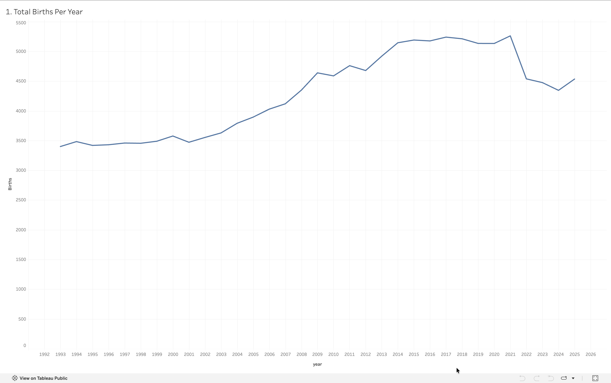

# Analysis 1: Total Births Per Year

[← Back to main README](../README.md)

## What this shows
Total number of births recorded in Zürich each year, from 1993 through 2025. 

## Method
Grouped the cleaned dataset by `year` and summed the `births` column.
## Visualization

## Observations
- Births held roughly flat around 3,400–3,600/year through the 1990s 
- A steady climb begins in the early 2000s, accelerating sharply after 2005 
- Peaked at ~5,261 in 2021 — a 55% increase over the 1993 starting point 
- Declined after 2021, settling around 4,500–4,600 by 2025 — still 33% above where the series started, despite the recent pullback
