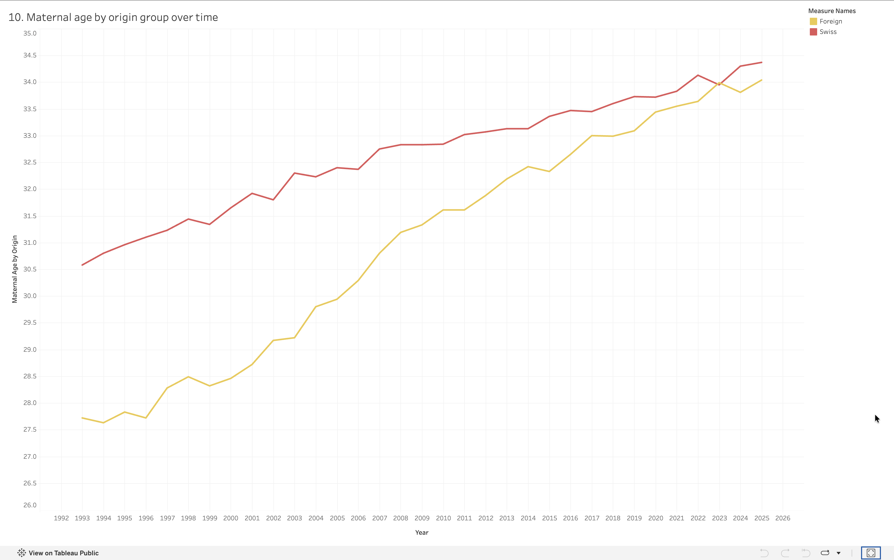

# Analysis 10: Maternal Age by Origin Group Over Time

[← Back to main README](../README.md)

## What this shows
Average maternal age per year, split by mother's origin (Swiss vs. foreign), from 1993 through 2025 

## Method
Same weighted-average approach as Analysis 7 (`sum(age × births) / sum(births)`), computed separately per `mother_origin` group per year 

## Visualization

## Observations
- In 1993, Swiss-origin mothers averaged 30.58 years old versus 27.72 for foreign-origin mothers, a gap of roughly 2.9 years
- That gap narrows steadily and substantially over the full period, by around 2022–2023 the two lines converge almost completely, briefly crossing
- Swiss-origin maternal age pulls slightly ahead again by 2024–2025, so this reads as near-convergence with a brief crossover rather than a clean, permanent reversal
- Both groups still show the same overall upward trend as Analysis 7; the convergence is about the gap shrinking, not about either group's age declining
