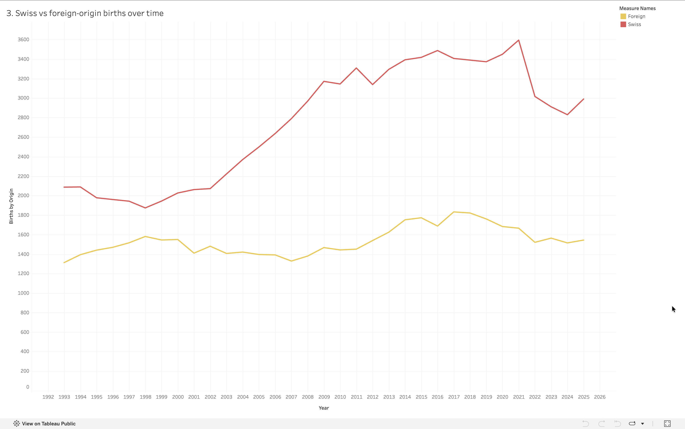

# Analysis 3: Swiss vs Foreign-Origin Births Over Time 

[← Back to main README](../README.md)

## What this shows
Number of births per year, split by mother's origin (Swiss vs. foreign), from 1993 through 2025 

## Method
Grouped the cleaned dataset by `year` and `mother_origin`, summing the `births` column for each

## Visualization

## Observations
-  Both groups grew over the period, but at very different rates: Swiss-origin births roughly grew from ~2,100 (1993) to a peak of ~3,600 (2021), while foreign-origin births grew more modestly, from ~1,300 (1993) to a peak of ~1,800 (2017)
- Because Swiss growth outpaced foreign growth, the gap between the two widened over time: from roughly 780 births apart in 1993 to nearly 1,750 apart at the 2021 peak 
- Both groups declined together after 2021, mirroring the citywide pullback seen in Analysis 1 
