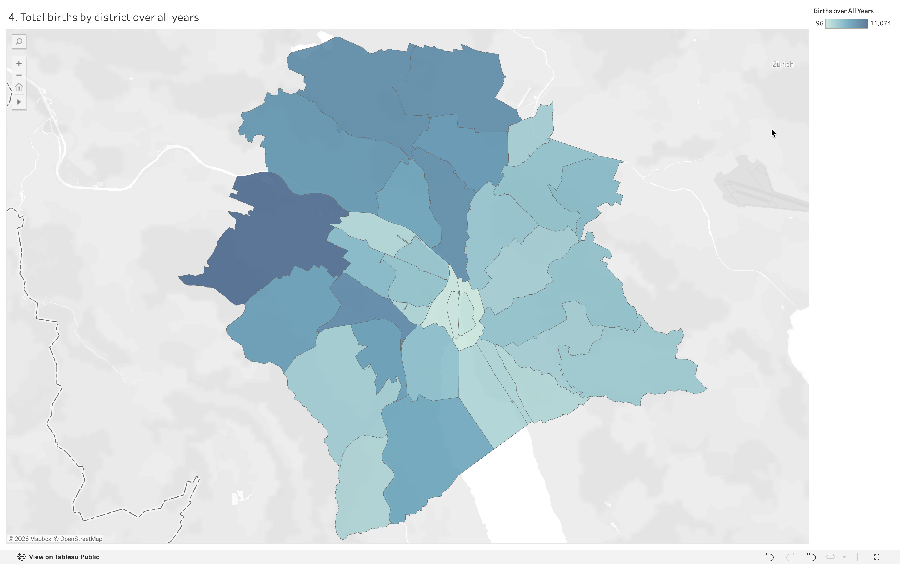

# Analysis 4: Total births by district over all years

[← Back to main README](../README.md)

## What this shows
Total births in each of Zürich's 34 districts, summed across the full 1993–2025 period, as a choropleth map 

## Method
Grouped the cleaned dataset by `district_code` and `district_name`, summed `births`, and joined the result to Zürich's official district boundary GeoJSON (Stadt Zürich Open Data) to render as a map in Tableau 

## Visualization

## Observations
- Totals range from 96 to 11,074 across districts, roughly a 115x spread, reflecting how much residential population varies district to district 
- The darkest (highest-total) district sits in the far west — consistent with Altstetten, one of the city's largest residential districts
- The lightest cluster sits right in the map's center: the old town core (Rathaus, Lindenhof, City, Hochschulen), which is mostly commercial, historic, or university space rather than residential 
- Peripheral districts generally shade darker than central ones, which tracks with where actual housing is concentrated in Zürich 

## A technical note
Building this map required chaining three tables together in Tableau (GeoJSON shapes → an attribute lookup table → the births CSV), since the raw boundary file only contained sequential row IDs, not the actual district codes needed to match against the births data 
