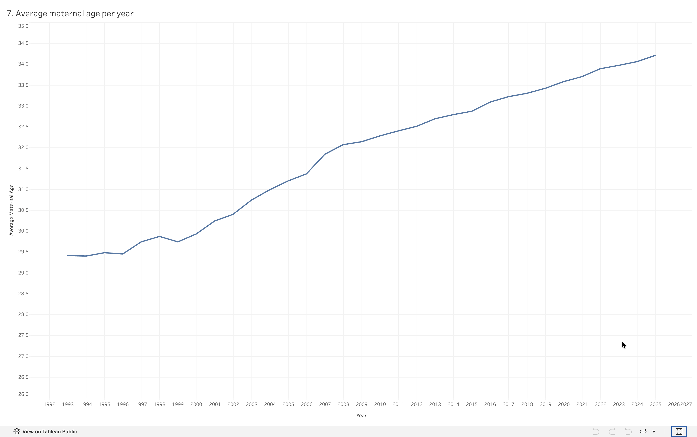

# Analysis 7: Average Maternal Age Per Year 

[← Back to main README](../README.md)

## What this shows
Average maternal age at childbirth in Zürich, year by year from 1993 through 2025 

## Method
Computed as a weighted average per year (`sum(age × births) / sum(births)`), not a simple row-wise mean, since each row represents multiple births at a given age, weighting by birth count is necessary for the average to be accurate. Rows with unknown/undisclosed age codes were excluded beforehand 

## Visualization

## Observations
- Average maternal age rose from 29.41 in 1993 to 34.21 by 2025, an increase of nearly 5 years over three decades
- The climb is steady but not linear: growth accelerates noticeably from the early 2000s through around 2008, then continues at a somewhat gentler, consistent pace through 2025
- No year shows a meaningful reversal, maternal age trends upward across the entire 32-year period without dipping back down
