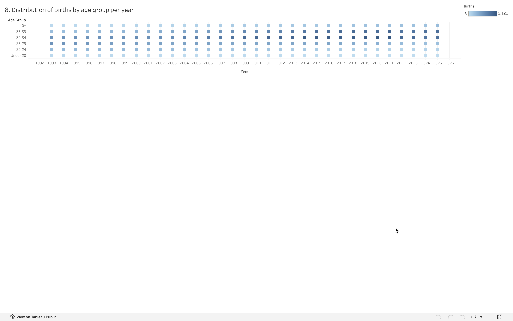

# Analysis 8: Distribution of Births by Age Group Per Year

[← Back to main README](../README.md)

## What this shows
A heatmap of birth counts across six maternal age brackets (Under 20, 20-24, 25-29, 30-34, 35-39, 40+), year by year from 1993 through 2025.

## Method
Binned `mother_age` into six brackets using `pd.cut()`, grouped by year and age group, summed births. Rendered as a Tableau heatmap (Square marks, sequential color palette) rather than a stacked or line chart, since a grid makes it easy to scan a single age bracket's row and see it grow or shrink over three decades at a glance 

## Visualization

## Observations
- The 30-34 bracket is the darkest (most common) row across nearly every year in the dataset, the modal age for childbirth in Zürich stays consistent even as the average shifts
- The 35-39 row visibly darkens moving left to right across the decades, while Under 20 and 20-24 lighten, a visual confirmation of the same upward drift in maternal age seen in Analysis 7, just broken out by bracket instead of collapsed into a single average 
- Counts per cell range from 6 to 2,121; the Under-20 bracket sits at the extreme low end in essentially every year, confirming it's a genuinely rare category rather than a data artifact 

## A technical note
Binning required care with pandas' `pd.cut()` bin edges to make sure ages right at a bracket boundary (e.g., exactly 20 or 25) landed in the intended group rather than the one below it
