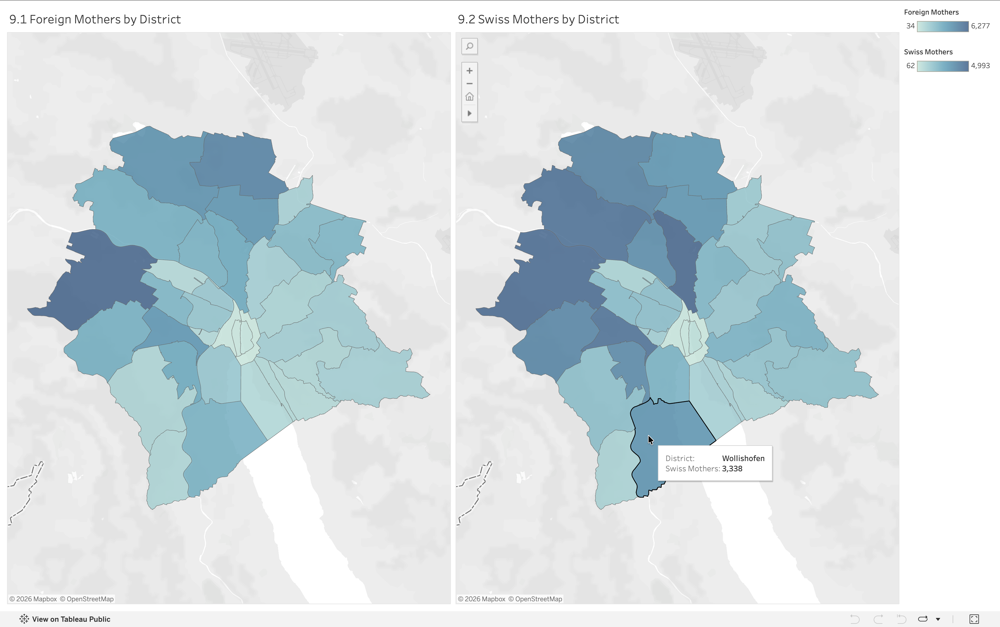

# Analysis 9: Foreign-Origin and Swiss Mothers by District

[← Back to main README](../README.md)

## What this shows
Two side-by-side choropleth maps: total births to foreign-origin mothers by district, and total births to Swiss-origin mothers by district, both summed across 1993–2025 

## Method
Split the cleaned dataset by `mother_origin`, grouped each half by district, and built two separate maps sharing the same district geometry, added the Swiss-side map after the original foreign-origin-only version, so the two origins could be compared directly rather than viewed in isolation.

## Visualization

## Observations
- The same district in the far west (visually consistent with Altstetten across every other district map in this project) is the darkest shape on both maps; it leads in both Swiss- and foreign-origin births, not just overall volume
- The central old-town cluster stays the lightest area on both maps, consistent with every other district visualization in this project 

## A technical note
The two maps use independent color scales (foreign-origin ranges 34–6,277, while
Swiss-origin ranges 62–4,993) rather than a shared fixed range, should check each legend individually rather than comparing shade darkness directly across the two maps, since the same visual intensity doesn't represent the same underlying number on both sides 
